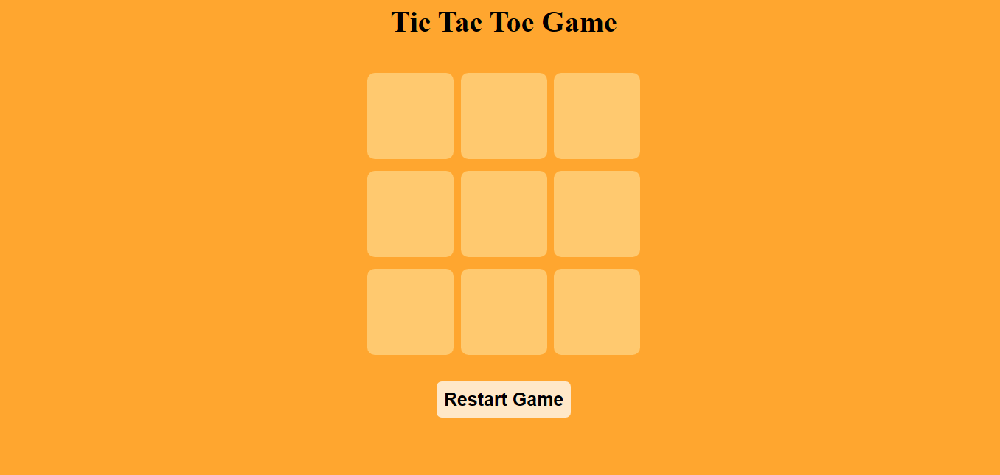

# 🎮 Tic Tac Toe Web Game

A simple, fun, and responsive Tic Tac Toe game built with **HTML**, **CSS**, and **JavaScript**. Play against a friend, detect wins or draws in real-time, and enjoy a clean user experience.

---

## 🌐 Live Demo

 🔗 [Play Now on GitHub Pages](https://mubeen2005.github.io/Tic-Tac-Toe/)

---

## 🖼️ Preview

  

## 🧰 Tech Stack

- 🧱 HTML5 – Markup for the 3x3 board
- 🎨 CSS3 – Styling and layout with responsiveness
- ⚙️ JavaScript – Game logic, event handling, and win/draw detection

## ✨ Features

- ✅ Two-player mode (Player X and Player O)
- 🧠 Real-time win & draw detection
- 🔁 Restart button to play again
- 📱 Responsive design for mobile and desktop
- 🎨 Minimal and clean UI

